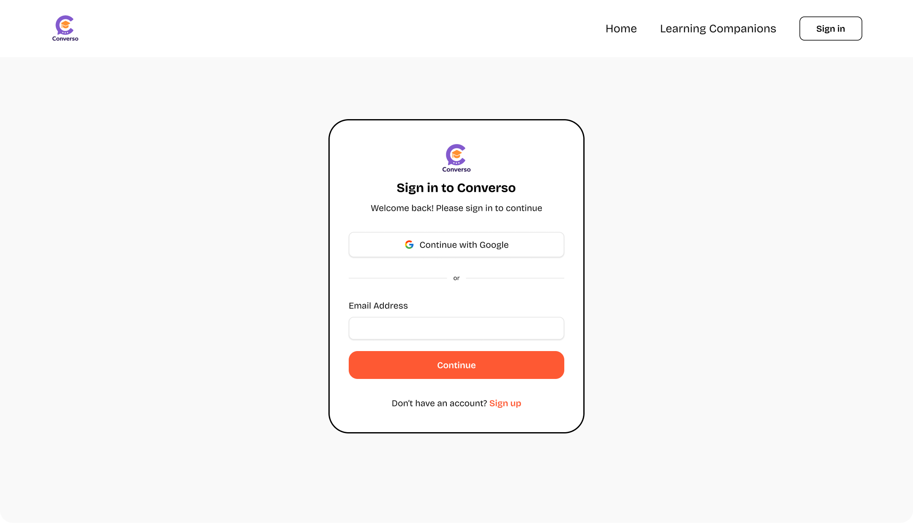
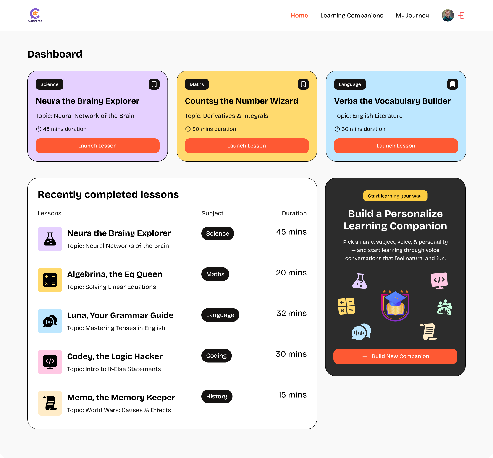
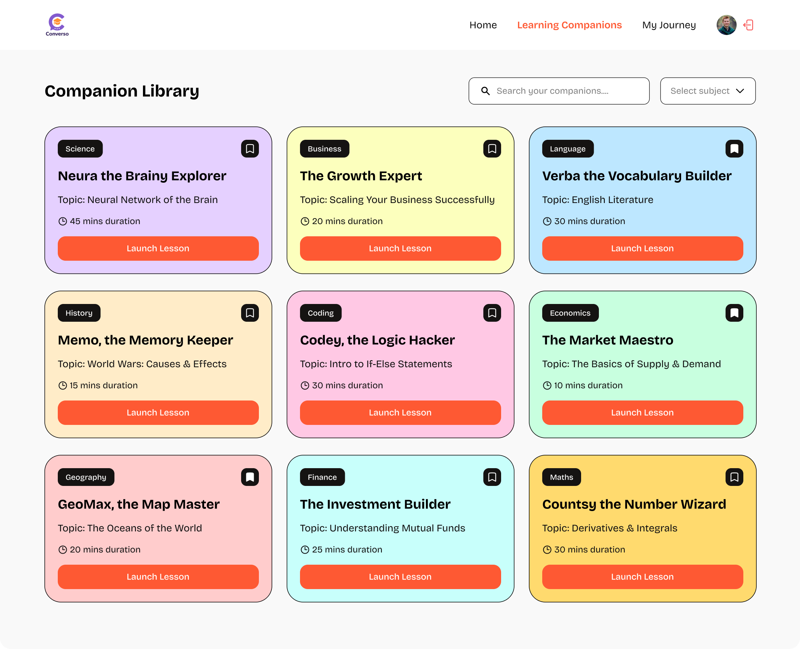
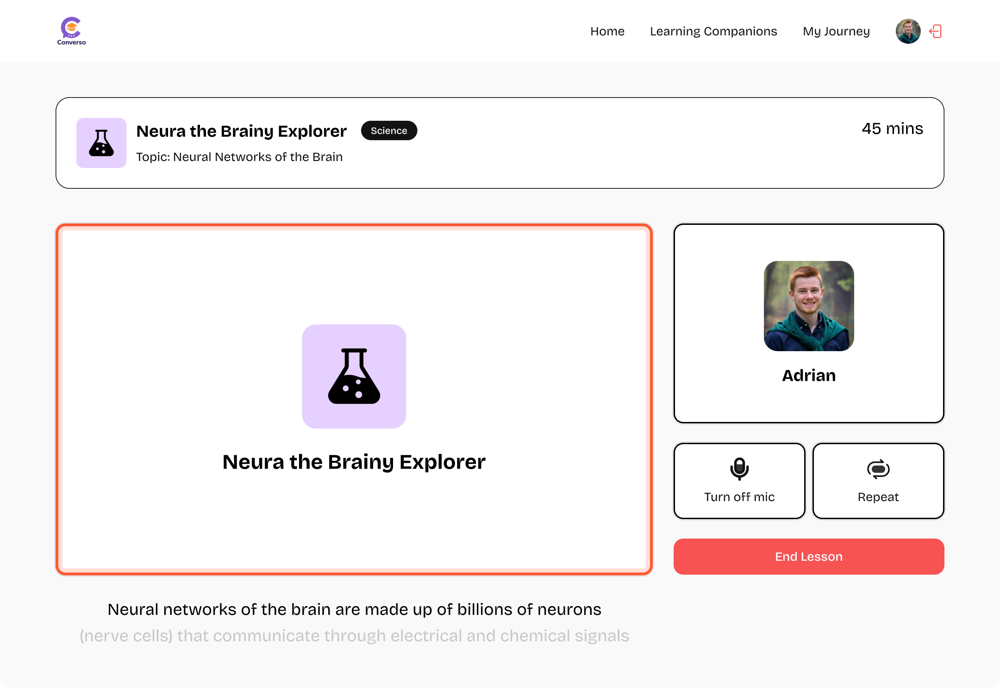
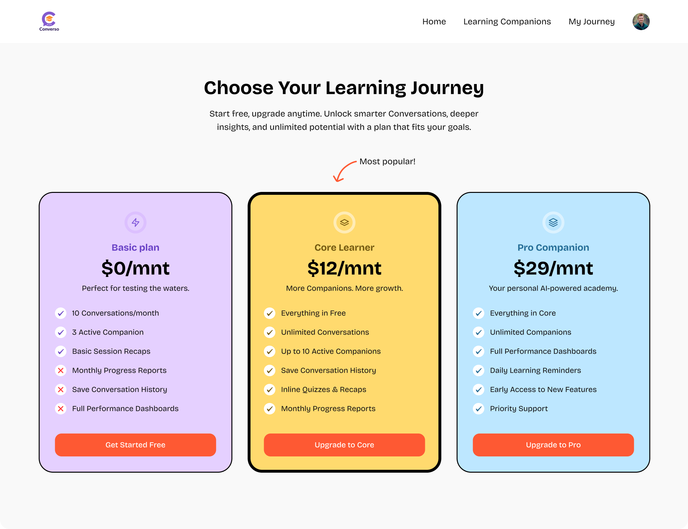

<div align="center">
  <br />
  <div>
    
    
    
    
    
    
  </div>

  <h3 align="center">Conversio – Real-time AI Teaching Platform</h3>

  <div align="center">
    This project was built following the<b>JavaScript Mastery</b> course.
  </div>
</div>

---

## 📋 Table of Contents

1. 🤖 [Introduction](#introduction)  
2. ⚙️ [Tech Stack](#tech-stack)  
3. 🔋 [Features](#features)  
4. 🖼️ [Screenshots](#screenshots)  
5. 🤸 [Quick Start](#quick-start)  
6. 🚀 [More](#more)  

---

## 🤖 Introduction

Conversio is an LMS SaaS app built with **Next.js 13 App Router**.  
It features **Clerk authentication**, **Supabase database**, **real-time AI tutors with Vapi**, and a modern UI with **Tailwind + shadcn/ui**.  

This project is a hands-on clone from the **JavaScript Mastery SaaS Course**, customized with additional features.

---

## ⚙️ Tech Stack

- **Next.js 13+ App Router** – React framework for full-stack apps  
- **Clerk** – Authentication and user management  
- **Supabase** – Database, APIs & storage  
- **Tailwind CSS** – Utility-first CSS framework  
- **shadcn/ui** – Accessible, pre-styled components  
- **Zod + React Hook Form** – Schema validation & form handling  
- **TypeScript** – Static typing for better DX  

---

## 🔋 Features

✅ AI Voice Tutors with Vapi  
✅ User Authentication (Google, Email, etc.) with Clerk  
✅ Create & Customize AI Companions (subject, topic, style, duration)  
✅ Session History & Bookmarks  
✅ Responsive & modern UI/UX with Tailwind + shadcn/ui  
✅ Supabase integration for data handling  
✅ Clean, reusable code architecture  

---

## 🖼️ Screenshots 
<h5 align="left">screenshots of the figma design</h5>

<p align="center">
  
</p>
<p align="center">
  
</p>
<p align="center">
  
</p>
<p align="center">
  
</p>
<p align="center">
  
</p>
<p align="center">
  
</p>

<p align="center">
  
</p>
<p align="center">
  
</p>

---

## 🤸 Quick Start

### 1️⃣ Clone the Repository  
```bash
git clone https://github.com/n0tg0d/SaasConversio.git
cd conversio
```

### 2️⃣ Install Dependencies
```bash
npm install
```
### 3️⃣ Setup Environment Variables

Create .env in the project root:
```
NEXT_PUBLIC_CLERK_PUBLISHABLE_KEY=
CLERK_SECRET_KEY=
NEXT_PUBLIC_CLERK_SIGN_IN_URL=/sign-in
NEXT_PUBLIC_CLERK_SIGN_IN_FALLBACK_REDIRECT_URL=/
NEXT_PUBLIC_CLERK_SIGN_UP_FALLBACK_REDIRECT_URL=/

NEXT_PUBLIC_SUPABASE_URL=
NEXT_PUBLIC_SUPABASE_ANON_KEY=
```

### 4️⃣ Run Dev Server
```
npm run dev
```

Project runs on 👉 http://localhost:3000